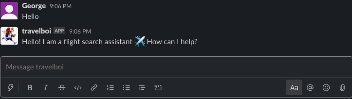

# Travel Chatbot on Slack

The purpose of this project is to build a simple chatbot where a user can request flight prices through a conversation.

Presentation of results can be found in this repo as well. Note that work added to this repo is an ongoing basis and so the slides represent progress during April 2020.

## Prerequsite
Notebook and script are written in Python 3. The libraries used for this project are listed under the `requirements.txt` file. It is recommended to first set up a virtual environment and then install the libraries with:

```bash
pip3 install -r requirements.txt
```

## Description
We have built a chatbot called ‘travelboi’ capable of understanding and responding to a person's requests. There are two main components in the Rasa stack that helped build this travel assistant — Rasa NLU & Rasa core. Intent classification and entity recognition is handled by Rasa NLU, while Rasa core is the main framework of the stack where it provides dialogue management backed by machine learning. 

This repo contains some training data and the main files needed to build an assistant on your local machine. The travel assistant consists of the following files:

- **data/nlu.md** contains training examples for the NLU model  
- **data/stories.md** contains training stories for the Core model  
- **config.yml** contains the model configuration
- **domain.yml** contains the domain of the assistant  
- **credentials.yml** contains credentials for the Slack channel
- **actions.py** contains actions used by the chatbot such as searching flight offers

## Demo


## Try it for yourself!

Instead of just looking at the demo, try the application out for yourself by cloning the repo and simply running this command to start up the application:

```bash
python3 app.py
```